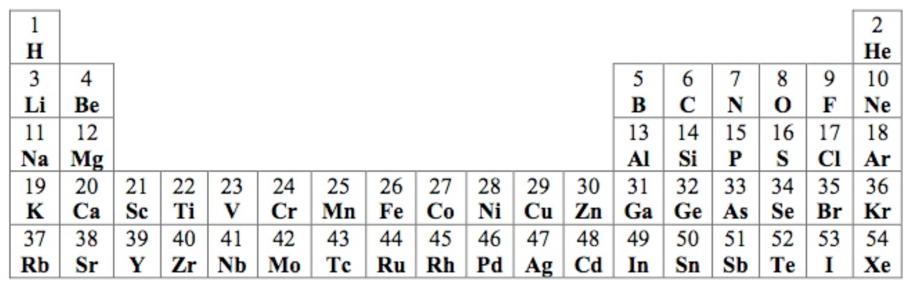

# Assignment 2

A molecule is made of two or more atoms, where each atom can occur more than once. An atom is represented by an atomic symbol consisting of a single uppercase letter or an uppercase letter followed by a lowercase letter (e.g. H, O, Fl, Na).

An atom also has an atomic number that represents the number of protons in that atom. For example, the chlorine atom (Cl) has an atomic number of 17, which means it has 17 protons.



A molecular formula is a non-empty sequence of atomic symbols (e.g. KBr, CO, LiCl).
* Part of the formula may be repeated by enclosing it in parentheses followed by an integer between 2 and 99 (e.g. Ca(OH)2).
* The parentheses are omitted if the repeating component is a single atom (e.g. H2O, C6H12O6, Na2SO4, Ni(NO3)2).
* A molecular formula can consist of a single atom (e.g. H) or a single atom repeated (e.g. O3)
* It can also consist of multiple levels of parentheses (e.g. Co3(Fe(CN)6)2).

## Assignment

1) Modify the `Algorithm` method in the Java program named FormulaCalc.java found in **src/main/java/org/assignment2**. It takes a string representing a valid molecular formula and computes and returns the total number of protons in the molecule. The method should use a stack to keep track of partial results as you encounter subexpression in the chemical formula.

    * You may assume that the atoms in the formula all have atomic numbers no greater than 54 and appear in the truncated periodic table shown below. Each box shows the atomic symbol along with its atomic number.

    * Use the Java class Stack for your stack class. Do not call any methods except push, pop, empty, and peek.
    * The formula can potentially have any number of layers of parentheses.
    * You may assume that if an integer is given in the formula it will be in a valid location and its value will be between 2 and 99, inclusive.
    * You may assume that the given formula is valid, including only atoms shown above and proper layering of parentheses.

## Testing

* Testing can be done through Maven with the command, <br> 
`mvn test` <br>
* To run more specific tests, run the command <br> 
`mvn -Dtest=FormulaCalcTest#TESTCASEHERE test` <br>
where `TESTCASEHERE` is the test case you want to run. These test cases can be found in **src/test/java/FormulaCalcTest** <br>
  * For example,  `mvn -Dtest=FormulaCalcTest#test_with_H test` runs your algorithm against the input string "H" where it expects an integer 1 as the output.

The results can be found in the command line or in **target/surefire-reports/FormulaCalcTest.txt** after execution.

**Part of grading will be these test cases.**

Alternatively,

You can write your main method so that it reads input from the keyboard (standard input) and outputs its results to the console (standard output) for testing. The first line of input should be the number of test cases to be executed. Subsequent input will be one chemical formula per line. For each formula, output the number of protons in the formula. Each output should be on a separate line. You do not need any additional prompts or output text.

Or you can use the formulas.txt file in the folder.

Example input:

```txt
7
H
KBr
Ca(OH)2
H2O
C6H12O6
Ni(NO3)2
Co3(Fe(CN)6)2
```

Example output:

```text
1
54
38
10
96
90
289
```
